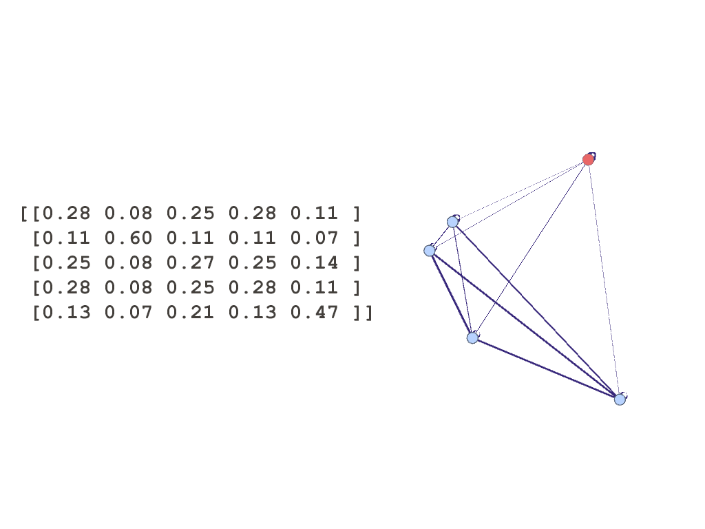

# PySClump [](https://travis-ci.com/ameya98/PySClump)
A Python implementation of 'Spectral Clustering in Heterogeneous Information Networks' from AAAI, 2019.  
This was heavily inspired by the original [implementation](https://github.com/lixiang3776/SClump) in MATLAB.

<p align="center">
    
</p>

*Figure: A similarity matrix represented as a graph. Nodes are coloured according to their assigned cluster.*

## References
Li, Xiang and Kao, Ben and Ren, Zhaochun and Yin, Dawei. 'Spectral Clustering in Heterogeneous Information Networks'. Proceedings of the AAAI Conference on Artificial Intelligence: 4221-4228.

## Installation
PySClump is available on PyPI! Install with:
```
pip install pysclump
```

## PathSim
We provide PathSim as a similarity metric between pairs of nodes. However, PySClump works with any similarity metric! See the SClump section below.

```
from pathsim import PathSim
import numpy as np

type_lists = {
    'A': ['Mike', 'Jim', 'Mary', 'Bob', 'Ann'],
    'C': ['SIGMOD', 'VLDB', 'ICDE', 'KDD'],
    'V': ['Pasadena', 'Guwahati', 'Bangalore']
}

incidence_matrices = { 
   'AC': np.array([[2, 1, 0, 0], [50, 20, 0, 0], [2, 0, 1, 0], [2, 1, 0, 0], [0, 0, 1, 1]]),
   'VC': np.array([[3, 1, 1, 1], [1, 0, 0, 0], [2, 1, 0, 1]])
}

# Create PathSim instance.
ps = PathSim(type_lists, incidence_matrices)

# Get the similarity between two authors (indicated by type 'A').
ps.pathsim('Mike', 'Jim', metapath='ACA')

# Get the similarity matrix M for the metapath.
ps.compute_similarity_matrix(metapath='ACVCA')
```

## SClump
Once we have the similarity matrices (PathSim shown here), running SClump is really simple.
```
# Construct similarity matrices.
similarity_matrices = {
    'ACA': pathsim.compute_similarity_matrix(metapath='ACA'),
    'ACVCA': pathsim.compute_similarity_matrix(metapath='ACVCA'),
}

# Create SClump instance.
sclump = SClump(similarity_matrices, num_clusters=2)

# Run the algorithm!
labels, learned_similarity_matrix = sclump.run()
```

If we have n nodes to be clustered into k clusters, *labels* is a n-by-1 vector, with entries from 0 to (k - 1) indicating the cluster index assigned. *learned_similarity_matrix* is the n-by-n matrix S referenced in the paper, indicating node-to-node similarity.

The clusters themselves are assigned by k++-means clustering using the learned similarity matrix.
